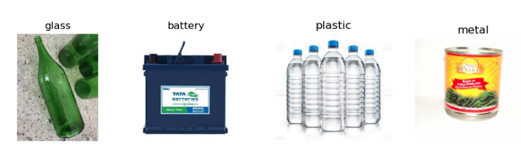
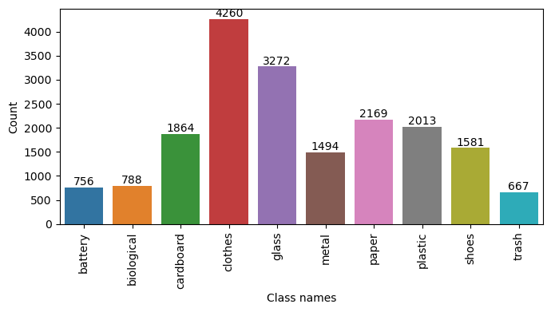
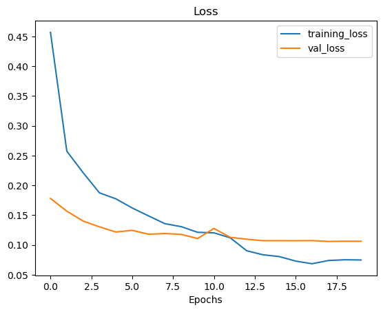
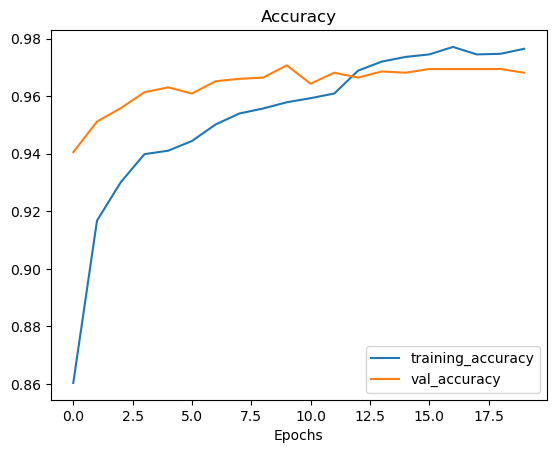
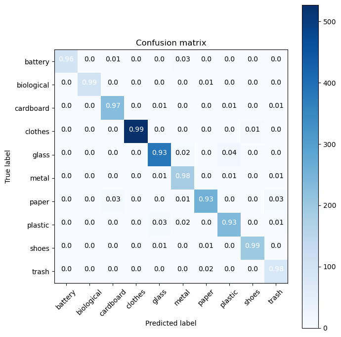
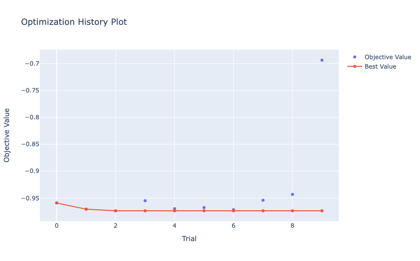
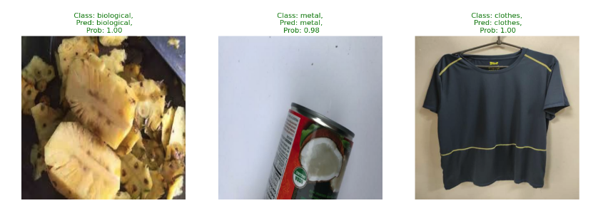

---
title: 'Deep-Waste: Managing Household Waste Through Transfer Learning'
tags:
  - Waste Classification
  - Machine Learning
  - Flutter
  - Firebase
  - Python
  - Transfer Learning
authors:
  - name: Suman Kunwar
    orcid: 0000-0002-4345-1050
    affiliation: "1" # (Multiple affiliations must be quoted)
affiliations:
 - name: Faculty of Computer Science, Selinus University of Sciences and Literature, Ragusa, Italy
   index: 1
date: 18 December 2023
bibliography: paper.bib

---

# Summary
Deep Waste[^1] is a mobile application that leverages state-of-the art computer vision and deep learning technologies to accurately classify waste materials into ten categories: battery, biological, trash, plastic, paper, shoes, clothes, metal, glass, and cardboard. This innovative solution was developed to address the challenges of costly, imprecise, and unclear waste classification methods. Deep Waste has undergone rigorous testing on a variety of neural network architectures and real-world images, achieving an impressive average precision of 96.41% on the test set. By enabling efficient waste processing, reducing greenhouse gas emissions, and promoting sustainable practices, this app has the potential to transform the field of waste management.

[^1]: Previously known as MWaste.

# Statement of need

The escalating global waste crisis, projected to surge by 70% by 2050 without intervention [@kaza_what_2018], demands innovative solutions. Diverse waste management techniques, from source reduction to education initiatives, strive to combat this issue [@mridha_intelligent_2021]. Yet, the absence of a standardized waste classification system results in regional disparities [@ferronato_waste_2019], emphasizing the need for efficient waste identification, crucial for integrated solid waste management [@fadhullah_household_2022].

Recent advancements leverage deep learning models to streamline waste sorting and management [@liu_image_2022]. These models, like RWNet and ConvoWaste, exhibit high accuracy, emphasizing the role of accurate waste disposal in mitigating climate change and reducing greenhouse gas emissions. Some studies incorporate IoT and waste grid segmentation to classify and segregate waste items in real time [@m_technical_2023].

Integration of machine learning models with mobile devices presents a promising avenue for precise waste management [@narayan_deepwaste:_2021]. The use of optimized deep learning techniques in an app demonstrates potential, achieving an accuracy of 0.881 in waste classification. However, limitations persist, prompting the introduction of Deep Waste, a mobile app employing computer vision to classify waste into ten types. Using transfer learning [@5288526], Deep Waste attains a remarkable 96.41% precision on the test set, functioning both online and offline.

# Model Development
The app uses the garbage classification model obtained by applying transfer learning approach to the  garbage dataset [@suman_kunwar_2023]. This dataset consists of 10 categories, including plastic, metal, glass, biological, paper, battery, trash, cardboard, shoes and clothes. Few sample images from the dataset are shown in \autoref{fig:sample_images} and  the count of each classes are shown in \autoref{fig:garbage_dataset}.

With uneven number of images in each classes, random undersampling [@LIU2020105292] is employed to balance uneven class sizes by excluding some data from the larger dataset along with image augmentation methods to address class imbalance. The dataset is divided into 3 sets: train (80%), validation (10%), and test. The train set trains the model, the validation set tunes parameters, and the test set evaluates accuracy on new data.

The model was trained with Tesla T4 GPU and uses EfficientNetV2 [@tan2021efficientnetv2] model as a base model with addition of agumentation layer. Adam [@kingma2017adam] was used as an optmizer with intital learning rate of 0.01. To prevent overfitting and improve generalization regularization techiques such as early stopping and dropout applied. The training and validation loss is shown in \autoref{fig:training_vs_val_loss} whereas \autoref{fig:training_vs_val_accuracy} shows training and validation accuracy on the performed [experiment](https://www.kaggle.com/code/sumn2u/garbage-classification-transfer-learning).

{width="50%"}

{width="50%"}

The accuracy of the trained model at 20 epoch was found to be 96%. \autoref{fig:confusion_matrix} shows the confusion matix of the model.

The hyperparameters were optmised using [optuna](https://optuna.org/) to create more accurate results. \autoref{fig:hyperparameters_optimization} shows the hyperparameter optmization over each trial. This optmized parameters were then fed into the model for training purpose. We found that the model performance was increased slighlty and the new accuracy is 96.41%. \autoref{fig:test_results} shows the test results with various sample test images.

The classification model is converted into a lite format using [TFLite](https://www.tensorflow.org/lite/guide) to enable its usage on mobile devices with limited resources. This format ensures faster loading times, smaller size, and compatibility with various programming languages and platforms. It is then packed with the Deep Waste app and released for public usage.

# App Workflow
\autoref{fig:deep_waste_app_workflow} describes the overall workflow of the app. Users can upload an image from either their camera or gallery. The image is then analyzed by the embeded classification model. Additionally, the amount of carbon emissions resulting from the predicted output is calculated, and a reward is given to the user for effectively managing waste. In the event of an incorrect prediction, users can submit the image to be used for training the model on an annual basis. A leaderboard is generated based on the number of points earned.

![App Workflow [@kunwar_suman_2023]\label{fig:deep_waste_app_workflow}](app-workflow.png){width="100%"}

The app also provides information on how to dispose of the waste and what recycling options are available. This approach can be customized to meet the user's specific needs, including local waste management regulations and individual household waste disposal habits and preferences. The home screen of the app is show in \autoref{fig:deep_waste_app}

{width="100%"}

The app's user interface is designed to be user-friendly and intuitive, making it easy for anyone to use. It can also be used in conjunction with other waste management services such as waste collection and recycling services. In the progress tracker screen, users can monitor their progress towards rewards and receive tips on managing household waste, as shown in \autoref{fig:progress_tracker_screen}.

{width="100%"}

In addition, a leaderboard is generated based on the [CO2 preserved](https://stopwaste.co/calculator/) by recycling/composting.  The waste classification results are shown in \autoref{fig:waste_classification_results}.

{width="100%"}

The app can help households reduce the amount of waste they generate, increase their recycling rate, and reduce the amount of waste that ends up in landfills.

# References